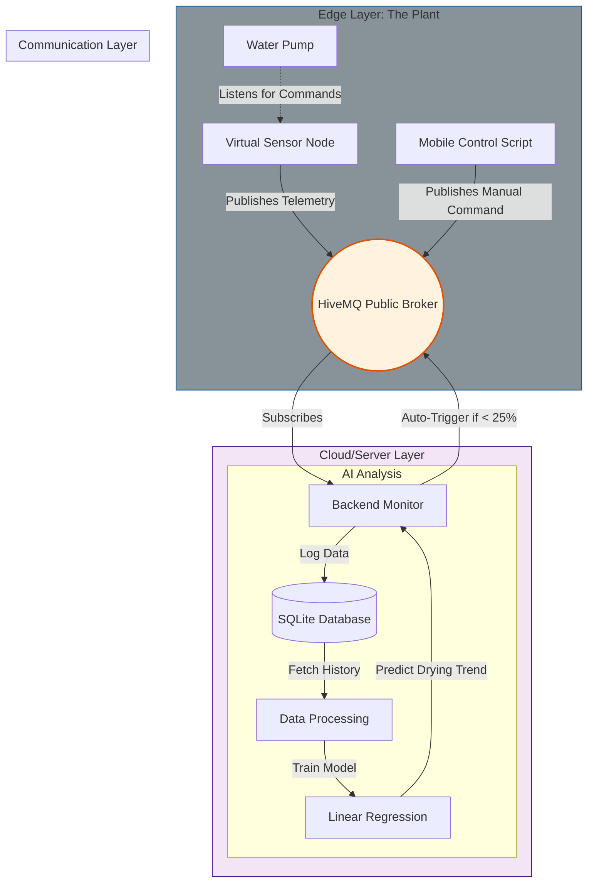

# 🌿 AIoT Smart Indoor Plant Monitor & Predictive Irrigation System


An end-to-end **Digital Twin simulation** of a smart agricultural environment. This project creates a complete IoT lifecycle—from Edge generation to Cloud analysis—without requiring physical hardware. It utilizes **Linear Regression** to transition from reactive threshold alerts to **Predictive Maintenance**, forecasting the precise moment a plant needs water.

## System Architecture (Edge-to-Cloud)

The following diagram illustrates the journey of data from the Virtual Sensor, through the MQTT Broker, to the Backend for storage/AI analysis, and the return path for actuation commands.



## Key Features

*   **Digital Twin Simulation:** Replicates ESP32 microcontroller, Soil Moisture Sensor & DH11 behavior, generating telemetry for Moisture, Temperature, and Humidity with realistic drying cycles and random sensor noise.
*   **Predictive Analytics:** Uses `scikit-learn` to calculate soil drying rates (slope analysis) and predicts the exact time usage will hit critical levels.
*   **Two-Way Communication:** Decoupled architecture using **MQTT**. Sensors publish data, while the backend and mobile app publish control commands (`WATER_ON`).
*   **Fail-Safe Automation:**
    *   **Warning Zone (<30%):** Sends a notification to the user to water remotely.
    *   **Critical Zone (<25%):** System takes control and auto-activates the pump to prevent plant death.
*   **Remote Interaction:** Includes a CLI-based mobile app simulation for manual overrides.

## Tech Stack

*   **Core Language:** Python 3.9
*   **IoT & Messaging:** `paho-mqtt` (HiveMQ Public Broker)
*   **Data Engineering:** `sqlite3` (Storage), `pandas` (Transformation)
*   **Machine Learning:** `scikit-learn` (Linear Regression), `numpy` (Math)
*   **Visualization:** Exportable CSV logs for Excel/Tableau.

## Project Structure

| File | Role | Description |
| :--- | :--- | :--- |
| `virtual_sensor.py` | **Publisher** | Simulates the ESP32 + Soil Sensor. Generates data and listens for water commands. |
| `backend_monitor.py` | **Subscriber** | The central server. Logs data, runs AI predictions, and triggers auto-watering. |
| `mobile_app.py` | **Controller** | Simulates a phone app. Allows the user to send manual "Water" commands via MQTT. |
| `plant_data.db` | **Storage** | Auto-generated SQLite database storing historical sensor readings. |

## Installation & Usage

### 1. Clone the Repository
```bash
git clone https://github.com/AUREX-ML/Smart-Indoor-Plant-Monitor.git
cd Smart-Indoor-Plant-Monitor
```

### 2. Install Dependencies
```bash
pip install requirements.txt
```

### 3. Run the Simulation
Open three separate terminal windows to observe the full lifecycle:

**Terminal 1: The Cloud (Start this first)**
```bash
python backend_monitor.py
```
*Status: Listening for data and performing AI analysis.*

**Terminal 2: The Sensors**
```bash
python virtual_sensor.py
```
*Status: Simulates drying soil and publishes JSON packets.*

**Terminal 3: The Mobile App (Optional)**
```bash
python mobile_app.py
```
*Status: Run this when you receive a "Warning" to manually trigger the pump.*

## 📊 Analytics
To export the recorded data for external analysis, simply stop the `backend_monitor.py` script using `Ctrl+C`. A CSV file (e.g., `plant_data.csv`) will be automatically generated.

---
*License: MIT*